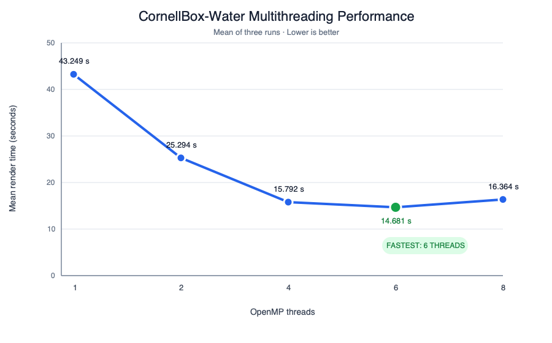

# Progressive photon mapping

# Description
In this project, we extended our basic ray tracer from Assignment 2 to do global illumination using the progressive photon mapping technique of Knaus and Zwicker. The program renders images offline and is fast due to the parallelization of the ray tracing passes. 

I first tried to implement standard photon mapping to make the task easier but I found it to be still a lot of work. So instead I followed the approach in Section 16.2 of PBRT 3. This change halfway unfortunately led to a lot of wasted time. 

The ```renders``` folders contains the images that were used during the demo. Also, the photons are color-coded in ```cornellbox-original-photon-bounce-overlay.png```: red photon is a direct diffuse hit, green is second hit, and cyan is third or later hit. 

# Compilation

The program requires OpenMP. To compile the program use ```cmake -S . -B build``` and then ```cmake --build build``` and to run the program use ```\build\CS488 name.obj``` where ```name.obj``` is the obj file that you would like to render. 

# Implementation

## Data structures and algorithms
### BVH
I implemented the Surface Area Heuristic which estimates the cost of the split as 
$$ 
C = N_L \cdot A_L + N_R \cdot A_R
$$
where $N_L$ is the number of triangles in the left region and $A_L$ is the total area of those triangles. Hence, the cost takes into acccount the probability that a random ray intersects a region. I implemented a full-sweep version which considers all possible primitives on each axis and hence costs $O(n^2)$ to build wehere $n$ is the number of primitives. To do the implementation, I followed a blog series on BVH by Jacco Bikker ([blog](https://jacco.ompf2.com/2022/04/13/how-to-build-a-bvh-part-1-basics/)) and also consulted PBRT's section 4.3. The code in ```bvh.h``` is based on parts 1 and 2 of the blog. The following table compares render times with SAH-BVH, with the naive non-SAH BVH, and without a BVH. The build time of BVH is not included in the calculation.

| Model Name | Triangle Count |Time with SAH | Time with naive BVH | Time without BVH |
| ---------- | --------------:| -------------:| -----------------:| -----------------:|
| CornellBox-Original-triangulated | 36 | 0.583798 s | 0.721308 s | 0.924416 s |
| CornellBox-Water | 7089 | 2.702817 s | 5.247191 s | 112.023004 s |

I ran each configuration five times, and the median render-only wall-clock time is noted. The number of iterations were set to 10, the photon count to 20000, and the depth to 20 for every run. All times are recorded in seconds.

### KD-tree 
I used a Kd-tree to implement the photon map. The balance function follows the pseudocode given in Section 2.2.1 in "A Practical Guide to Global Illumination using Photon Mapping". Locating a photon takes $O(log N)$ where $N$ is the number of photons in the tree and building takes $O(N log N)$. The range query takes a point and a given radius and collects all the photons within the radius of the specified point.


### Parallelization
A lot of the work in one iteration of photon mapping is independent and so ```Open MP``` is used for multithreading. For photon tracing, each thread traces an entire photon independently and uses its own random number generator. For ray tracing pass, image rows are distributed among threads one row at time and each thread computes radiance until a diffuse surface is reached or terminates due to depth. One RNG is created per Open MP therad to avoid concurrent access to a shared random-number generator. Knaus and Zwicker also suggest to parallelize the outer loop but I did not find the need to do that as the render times are quite fast already (given that the resolution isn't too large). Here is a table showing multithreading performance.

| Threads | Run 1 (s) | Run 2 (s) | Run 3 (s) | Mean (s) |
| -------:| ----------:| ----------:| ----------:| --------:|
| 1 | 42.815 | 43.386 | 43.545 | 43.249 |
| 2 | 24.866 | 26.213 | 24.802 | 25.294 |
| 4 | 15.871 | 15.733 | 15.773 | 15.792 |
| 6 | 14.854 | 14.671 | 14.517 | 14.681 |
| 8 | 16.611 | 15.875 | 16.607 | 16.364 |

Each run used CornellBox-Water at a resolution of 512 by 384, with 50 iterations, 100,000 photons, and depth of 20. The time is only calculated for rendering and excludes bvh construction, image writing etc. I used ChatGPT Plus to convert the table above into a graph. Here is the result. 



It is interesting to see that 8 threads caused a slight uptick in time as compared to 6 threads. I'm not sure why this is. 


## Input/Output and pre-processing
I am still using the obj loading and mesh processing functions that were provided in the base code. For a model, the associated ```.mtl``` file should have ```Ke``` values provided for every object at the end of the description for the object. This is done because of the way the area lights are configured. In addition, the object which should be treated as glass should have ```glass``` prefixed to their name in the ```.mtl``` file. I manually configured these ```.mtl``` files for the models provided in ```media``` folder. Also, the ```.obj``` files should be triangulated.

Camera paramaters for the models: 

sunlit_caustics
globalEye = float3(0.0f, 1.65f, 3.5f);
globalLookat = float3(0.0f, 0.38f, -0.2f);

CornellBox-Water
globalEye    = float3(0.0f, 0.8f, 3.2f);
globalLookat = float3(0.0f, 0.8f, 0.0f);


CornellBox-Original-triangulated
globalEye    = float3(0.0f, 0.0f, 1.5f);
globalLookat = float3(0.0f, 0.0f, 0.0f);


## Global constants 
To change camera parameters, you can refer to lines 44-45 in ```main.cpp```. The width and height of the output image can be set at lines 36-37 in ```config.h```. The number of iterations for the main loop, trace depth, number of photons per pass, initial radius, alpha can all be set from ```main.cpp```. 

## Caveats and bugs 
- A huge caveat of this renderer is the custom ```.mtl``` file specification. Every object in the file needs to have a ```Ke``` value at the end of the specification so that the object is read properly. It would be much better to have proper loading rather than this hard coded setup. 

- Another caveat is the way that the camera is set up. Again you have to manually change the eye and look at for the models to work properly and it would be nice to have renderer that can automatically set the eye and lookat when loading the model. 

- I was also unable to implement effects like depth of field, volumetric rendering due to lack of time. This is a pity because this implementation is supposed to be able to render those effects. 

- The spheres in the rendering of CornellBox-Water contain rectangular facets which I was unable to fix. 

- Border artifacts are present in the renders. I did not have much time to experiment with the camera settings and mesh loading. 

## Acknowledgements
Much of the code here is based on Section 16.2 of PBRT (3rd edition). I first started this project by trying to implement the standard photon mapping approach by following the course notes of Henrik Wann Jensen but found it very time consuming to implement and I switched over to PBRT since my goal was to do stochastic progressive photon mapping. I tried mainly to link together the pseudocode given in the Knaus and Zwicker paper and PBRT's implementation. 

Both the Cornell Box models are from the McGuire Computer Graphics Archive. The sunlit_caustics scene was modeled using Blender. 


## AI Disclosure 
I used ChatGPT Plus to help me format the ```.mtl``` files in the format of the mesh loader. I also used it for bug fixes (specifically when I got multiple segmentation faults, NaN errors), and testing the Kd-tree and photon tracing. Here are some examples of queries I used: 

- Why is there a segmentation fault when i run ./build/examples/main.cpp with cornellbox.obj and cornellbox.mtl? Please check the mesh loader and ensure that the triangles are getting parsed properly.

- How do I use the C++ random library? I want to create samplers for each individual thread and not rely on the pcg_32 namespace.

- How do I use OpenMP to parallelize for loops? Give me some examples and explain the syntax of Open MP. What are some caveats about Open MP that I should be aware of? 


# Objectives
1. Implement SAH BVH 
2. Implement KD tree for photon storage
3. Implement area lighting for soft shadows
4. Implement Fresnel reflectance
5. Implement photon tracing pass 
6. Compute radiance estimate 
7. Implement importance sampling 
8. Render a final image showing glass caustics 

# Extra 
9. Do parallelization to speed up the renderer


# Bibliography
1. Claude Knaus and Matthias Zwicker. 2011. Progressive photon mapping: A probabilistic approach. ACM Trans. Graph. 30, 3, Article 25 (May 2011), 13 pages. https://doi.org/10.1145/1966394.1966404
2. Jacco Bikker. April 2022. How to build a BVH. https://jacco.ompf2.com/2022/04/13/how-to-build-a-bvh-part-1-basics/
3. Henrik Wann Jensen. 2001. A Practical Guide to Global Illumination Using Photon Mapping. https://www.cs.princeton.edu/courses/archive/fall18/cos526/papers/jensen01.pdf
4. Matt Pharr, Wenzel Jakob, and Greg Humphreys. 2016. Physically Based Rendering: From Theory to Implementation (3rd ed.). Morgan Kaufmann Publishers Inc., San Francisco, CA, USA.

